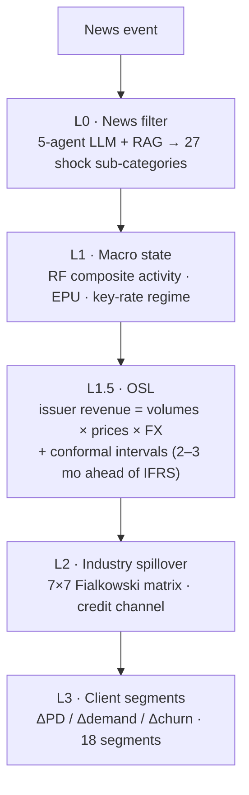

# Macro-Radar

A layered analytics pipeline that traces a single news event through the Russian macro
state, cross-industry spillover, and into bank client-segment credit risk — turning "what
just happened" into ΔPD / Δdemand / Δchurn estimates **2–3 months before the effect reaches
financial statements**.

Built as a submission for the ITMO Junior ML Contest. Public data only — no client or
portfolio data.

[](https://github.com/white-mi/jmlc_project/actions/workflows/test.yml)


[](LICENSE)

---

## Why it exists

Conventional credit stress-testing scores each borrower in isolation. That misses the
dominant failure mode of a downturn: one macro driver — a key-rate shock, a demand collapse —
hitting a *correlated group* of borrowers at once through shared supply chains. Fialkowski et
al. (2025, [arXiv:2502.17044](https://arxiv.org/abs/2502.17044)) quantify the resulting blind
spot at **+28 % to +70 %** of systemic risk.

Macro-Radar adds the missing layer. For a given event it produces one *traceable* chain:

```
news → Russian macro state → cross-industry cascade → bank client segment
```

Every number is attributable to a transmission channel and a public source, so an analyst can
defend the conclusion instead of trusting a black box.

## The pipeline (five layers)



| Layer | Role | Output |
|---|---|---|
| **L0** News filter | 5-agent LLM pipeline + RAG; classifies the event into one of 27 shock sub-categories | shock type + severity |
| **L1** Macro state | Russian composite activity index, EPU, key-rate regime | macro vector |
| **L1.5** Operational signal (OSL) | Forecasts issuer revenue from physical volumes × prices × FX, ahead of IFRS by 2–3 months | revenue + conformal interval |
| **L2** Industry spillover | 7×7 dependency matrix (Fialkowski), credit-channel propagation | ΔPD by industry |
| **L3** Client segments | Channel decomposition across 18 segments (5 channels) | ΔPD / Δdemand / Δchurn |

Seven industries: oil & gas, metallurgy, chemicals, retail, power, regional governments, pharma.

## Quickstart

```bash
git clone https://github.com/white-mi/jmlc_project.git
cd jmlc_project/_tools

pip install -r ../requirements.lock pytest   # pinned numeric stack (TF-IDF, offline)
python -m pytest tests/ -q                    # 214 passed, 0 skipped

# End-to-end smoke run — numbers at every layer, no LLM call:
python run_pipeline.py --smoke-shock 4.2 --smoke-industry oilgas

# L0 multi-agent news classifier — runs OFFLINE without an API key (deterministic dry-run):
printf "ЦБ РФ снизил ключевую ставку до 14%%" > news.txt
python agents/orchestrator.py --news-file news.txt --source TASS --date 2026-06-24 --llm-mode dry-run --no-save
```

Docker (the test suite runs inside the build, so the image only builds when green):

```bash
docker build -t macro-radar .
docker run --rm macro-radar
```

## Validation

The data-science layer is validated **out-of-sample**, not by assertion. On a public
metallurgy panel (5 issuers × FY2021–2025, IFRS revenue + exchange prices), expanding-window
walk-forward gives:

| Model | MAPE (common set) | DM p vs. structural |
|---|---|---|
| Structural OSL (domain prior) | 13.7 % | baseline |
| Gradient boosting | 12.1 % | 0.66 |
| Naive persistence (last year) | 11.0 % | 0.41 |
| Naive issuer-mean | 11.1 % | 0.43 |
| Regularised linear | ~41 % | 0.02 (overfits) |

The honest result: **at N = 24, no model — not even a naive persistence baseline — is
statistically distinguishable** (all Diebold–Mariano p > 0.4); only the regularised-linear models
clearly overfit. We *show* this rather than overclaim. The OSL's value is the operational
**lead-time** (estimating revenue from within-year prices before the annual report), not annual
point-accuracy on a 24-row panel. Split-conformal coverage is reported as a small-N artifact, not a
calibrated 90 %. Full write-up: [`docs/DS_REPORT.md`](docs/DS_REPORT.md).

A **second industry — oil & gas** (4 issuers × FY2021–2025, revenue verified via a two-pass
`/doublecheck` + `/fact-check` audit that caught 6 corrupted aggregator cells) is now validated the
same way. Here the finding *flips*: on volatile oil-&-gas revenue the price/volume models **beat
naive persistence** — `hist_gbm` 19.0 % vs. persistence 21.9 % MAPE, skill +13 %, DM p = 0.053 —
because naive "last-year = this-year" fails harder on geopolitical swings. The structural model is
deliberately deferred (annual НДПИ/fuel-damper history is a documented gap), so the comparison
baseline is persistence. Write-up: [`docs/DS_REPORT_OILGAS.md`](docs/DS_REPORT_OILGAS.md).

## Repository layout

```
_tools/                 Python package — every layer, plus tests/, data/, calibration/, agents/
  run_pipeline.py         end-to-end L0→L3 in one pass
  osl_*.py                OSL per industry + DS layer (panel / models / walk-forward / conformal)
  backtest_analyses.py    reproducible summary of the saved analysis corpus
docs/                   DS_REPORT, PRODUCT_REPORT, PROJECT_DESCRIPTION, guides, EDA figures, Fialkowski (2025) paper
_Справочники/           shock taxonomy, client-segment reference
requirements.lock · Dockerfile · Makefile · .github/workflows/test.yml
```

> The saved news-analysis corpus is internal and not shipped; tests run against a small synthetic
> fixture (`_tools/tests/fixtures/`), so the suite is deterministic on a clean clone.

> Documentation under `docs/` is partly in Russian (the project's working language). This
> README and `docs/DS_REPORT.md` are the English entry points.

## Honest limitations

Design facts, not bugs:

- The legacy conformal layer (`conformal_prediction.py`) is **in-sample**; genuine
  out-of-sample validation lives only in the DS layer (`conformal_split.py`).
- **L3 is not calibrated on bank data** (`confidence='low'`, expert priors).
- The ×1.30 spillover amplifier is a Fialkowski heuristic, **not yet calibrated on Russian shocks**.
- The DS layer is deep on two industries (metallurgy N = 24, oil & gas N = 18); the other five rely on in-sample actuals.

## Built with AI

Macro-Radar is both built *with* and built *on* AI: it was developed using Claude Code, and the
L0 layer is itself a five-agent LLM pipeline with retrieval. The contributor guide for the AI
assistant is [`CLAUDE.md`](CLAUDE.md).
