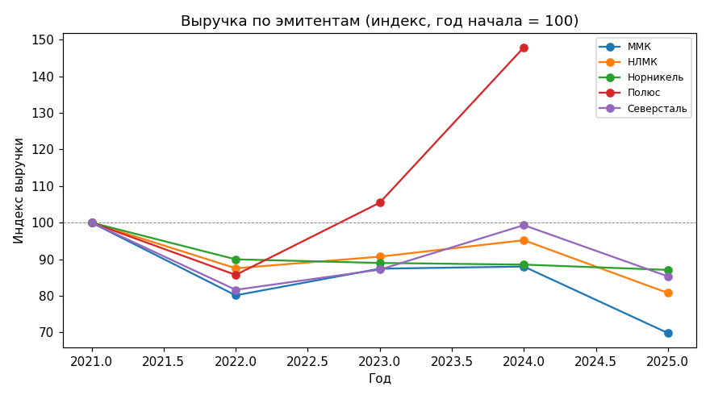
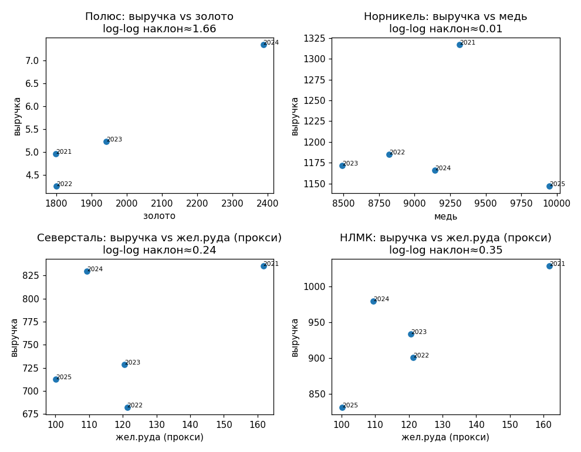
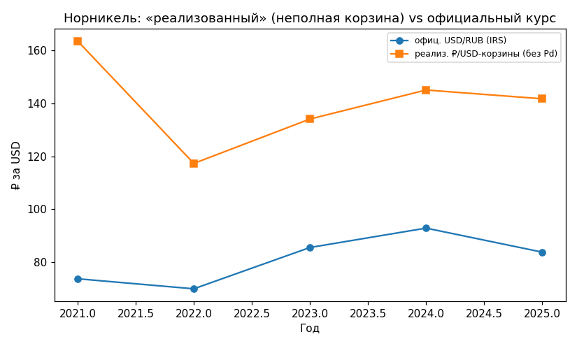
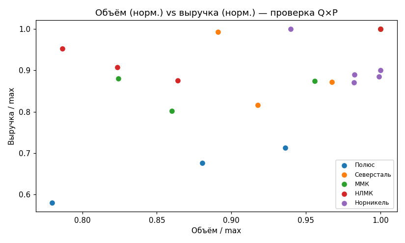
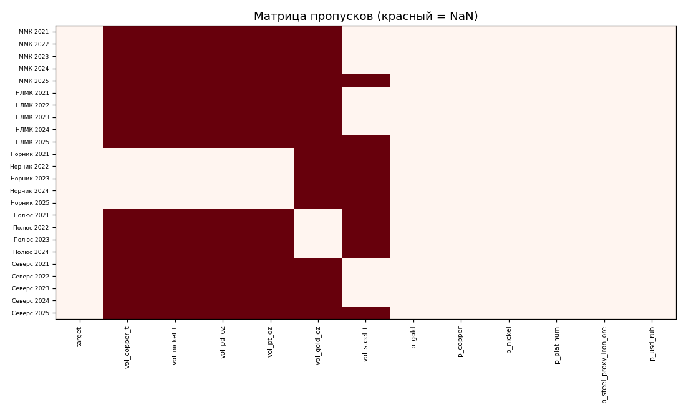
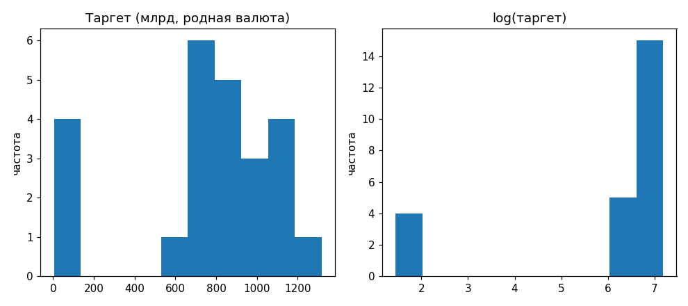
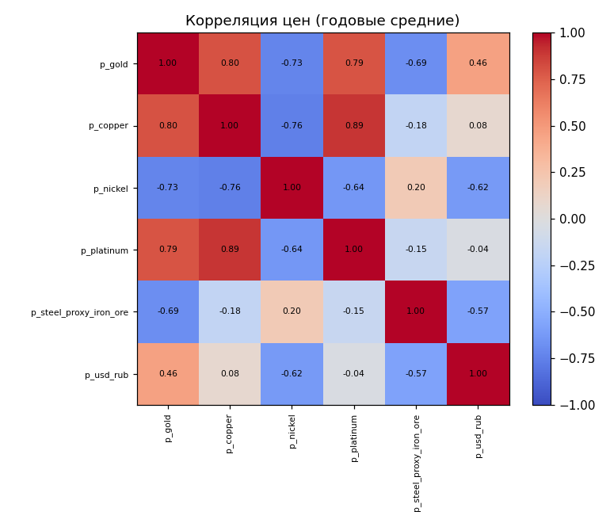
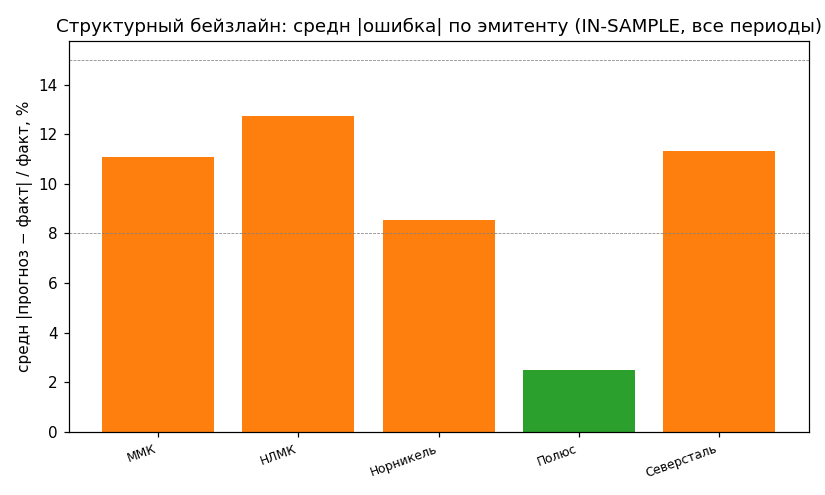

# DS-отчёт: прогноз выручки эмитентов металлургии с честной out-of-sample валидацией

> Доработка Data-Science-слоя проекta «Макро-радар» (L1.5 OSL). Цель — превратить
> структурный эвристический прогноз выручки (одна точка на эмитента, in-sample
> conformal) в **валидированный supervised-пайплайн** с реальной панелью данных,
> сравнением моделей и **out-of-sample** метриками. Этот файл — основа «Описания
> проекта» для Junior ML Contest.

## 1. Задача и данные

**Задача.** Прогнозировать годовую выручку публичных эмитентов металлургии по
операционным сигналам (объёмы производства × биржевые цены × FX) — опережающий
индикатор, дающий сигнал за 2–3 месяца до публикации МСФО.

**Панель** (`_tools/data/panel/`): **24 строки = 5 эмитентов × FY2021–2025**
(Полюс 2021–2024). Только публичные данные:

| Что | Источник | confidence |
|---|---|---|
| Выручка Полюс (USD) | первичные релизы Polyus IR | high |
| Выручка Норникель/Северсталь/ММК/НЛМК (RUB, МСФО) | smart-lab (агрегатор МСФО) | med |
| Цены Cu/Ni/Pt/Au, жел.руда | World Bank Pink Sheet | high |
| USD/RUB среднегодовой | IRS yearly average | high (2025 — low) |
| Объёмы Cu/Ni/Pd/Pt | Nornickel production releases | high |
| Объёмы золота / стали | Polyus IR / worldsteel | high / med |

**Кросс-валидация источника:** FY2025-выручка по smart-lab (Северсталь 712.9, ММК
609.9, НЛМК 831.4) **совпала** с независимыми `ACTUAL_REVENUE_12M_2025` в коде проекта
→ доверие к агрегатору подтверждено.

**Честно задокументированные пробелы** (`series_registry.documented_gaps`, не «тихий ноль»):
- **Цена палладия** (≈30% выручки Норникеля) — недоступна в открытых источниках
  (World Bank не ведёт Pd; Johnson Matthey — только графики). → структурная модель
  использует module-константу; learned-модели Pd-признака не имеют.
- **Цена стали HRC FOB** — только платный спот. → добавлен **прокси `steel_proxy_iron_ore`**
  (World Bank железная руда) как признак сектора + per-period масштабирование цены стали.

Изоляция: **только публичные данные**, никаких клиентских/портфельных данных банка.

## 2. EDA (`_tools/eda_osl.py`, `notebooks/eda_osl.ipynb`)

8 фигур, каждая с «импликацией для модели». Ключевые находки:

1. **Смешение валют** (USD Полюс ~$5–7 млрд vs RUB сталевары ~600–1300 ₽млрд, разброс
   на 2 порядка) → моделируем `log(выручка)` + **issuer fixed-effects** + метрика MAPE
   (валюто-инвариантна).
2. **Мультиколлинеарность цен** (VIF: медь 26.9, никель 18.5; макс|corr|=0.89; матрица
   цен почти вырождена, n=5 периодов < 6 цен) → **регуляризация обязательна** (ElasticNet/Ridge).
3. **Разреженность объёмов** (35% ячеек NaN: объёмы — поэмитентные) → **GBM с нативным
   NaN-handling**, а не импутация.
4. **Эластичность** выручки к цене: Полюс↔золото ≈1.66 (структурное допущение наклон=1
   занижено — реализация цены/хедж). Сталевары↔жел.руда — слабее (входная, не выходная цена).

**Фигуры** (регенерируются `python eda_osl.py` → `docs/figures/eda/`; каждая — с импликацией в
`figures/eda/implications.md`):

| | |
|---|---|
|  |  |
|  |  |
|  |  |
|  |  |

## 3. Модели (`_tools/osl_models.py`) — обоснование выбора

Единый интерфейс `fit(rows)/predict(rows)`; все таргеты в родной валюте эмитента.

| Модель | Идея | Почему |
|---|---|---|
| **StructuralOSL** | формула Q×P×FX (reuse) + 1 скаляр-коррекция на эмитента (из train) | сильный интерпретируемый prior; 1–3 параметра → не переобучить |
| **ElasticNet / Ridge** | log(цены) + within-issuer FE, таргет log(выручка) | регуляризация против коллинеарности цен (EDA #2) |
| **HistGradientBoosting** | + объёмы (нативный NaN), зажат (depth=2, leaf=4, L2=1) | гибкий компаратор; ожидаемо переобучается при N=24 |

**Within-issuer FE** (вычитаем per-issuer среднее log-таргета по train) — критично: без
него регуляризация сжимала уровень эмитента и тянула USD-Полюс к RUB-масштабу (MAPE
взлетал до 130%+). С FE сравнение стало честным.

## 4. Walk-forward валидация (`_tools/osl_walkforward.py`)

**Expanding-window**, сплит по времени: train = годы < t, test = год t (фолды 2022→2025).
Метрики на общем 16-строчном наборе (где все модели дали прогноз — честное сравнение,
т.к. структурная даёт NaN на gap-строках сталь-2025).

Включены **наивные бейзлайны** (которые рецензент спросит первым): `persistence` = «выручка
как в прошлом году», `issuer_mean` = «среднее эмитента по train».

| модель | MAPE_common | skill vs struct | DM p (vs struct) |
|---|---|---|---|
| **structural_osl** (доменный prior) | **13.7%** | 0 (бейзлайн) | — |
| hist_gbm | 12.1% | +0.12 | 0.66 |
| **persistence** (наивный) | **11.0%** | +0.20 | 0.41 |
| **issuer_mean** (наивный) | **11.1%** | +0.19 | 0.43 |
| elasticnet | 40.8% | −1.97 | 0.024 |
| ridge | 41.8% | −2.05 | 0.020 |

**Вывод (честный, без overclaim).** Наивные бейзлайны дают 11.0–11.1% — **номинально лучше** и
структурного prior (13.7%), и GBM (12.1%). Но **ни одно различие между structural / GBM /
persistence / issuer_mean не значимо** (все Diebold–Mariano p > 0.4). Единственный чёткий сигнал —
регуляризованные линейные (~41%) **переобучаются** на экстраполяции цен (скачок золота 2025).

Зрелый DS-вывод: **на N=24 панель статистически НЕ различает ни одну «разумную» модель — включая
тривиальный persistence**; мы это показываем (DM/skill), а не прячем за голым MAPE. Ценность OSL —
**не в годовой точечной точности** (где на таком N наивный baseline конкурентен), а в **операционном
лид-тайме**: OSL оценивает выручку из текущих (YTD) физических объёмов × цен **до** публикации годовой
отчётности — чего `persistence` (нужна прошлогодняя выручка) и `issuer_mean` дать не могут. Точечную
точность репортим честно; раннесть сигнала — отдельное измеримое преимущество (PRODUCT_REPORT, H1).

### 4b. Анти-leakage и воспроизводимость (проверено форензик-аудитом → вывод: чисто)

- **FX/цены — контемпоральные, не из будущего.** Признаки года *t* берут только годовое среднее
  года *t* (окно усреднения ⊆ финансовый год, enforced `test_panel.py`); цены и `usd_rub`
  джойнятся **по периоду** (`osl_panel.py`), не пулятся по годам. Walk-forward: train = годы < t +
  рантайм лик-гард `assert all(r.period_end.year < t for r in train)` (`osl_walkforward.py:56`).
- **Все обучаемые статистики — train-only:** issuer-FE (демин по train-средним), `StandardScaler`,
  структурный `k_` фитятся внутри `fit(train)`; ни одна не считается по всем годам.
- **NA — нативный NaN, без импутации/нулей:** пустые ячейки → `None`; GBM ест NaN нативно; линейные
  используют только цены (NaN-free); structural-gap-строки (сталь-2025, нет объёма) → NaN-прогноз и
  **маскируются** из метрик. Пробелы (Pd-цена, сталь-2025) задекларированы, не подделаны.
- **Смешение валют (USD-Полюс / RUB-остальные) безопасно:** issuer-FE снимает валютный сдвиг уровня
  (log-демин), structural предсказывает в родной валюте строки, MAPE — отношение (единицы
  сокращаются). Валюто-инвариантность — следствие, не допущение.
- **Бит-в-бит воспроизводимость:** `test_walkforward_bit_reproducible` — два прогона дают идентичные
  метрики (seed=42 / `random_state=0`, данные неизменны).

## 5. Conformal — честное out-of-sample покрытие (`_tools/conformal_split.py`)

Старые perturbation-интервалы (`conformal_prediction.py`) честно помечены **IN-SAMPLE**.
Добавлен **split/inductive conformal**:
- proper-train ≤2022 → calibration 2023 (**относительные** остатки |y−ŷ|/y — обмениваемы
  при смешении валют) → **отложенный test 2024–2025** (годы не пересекаются).
- конформный квантиль `ceil((n+1)(1−α))/n`; интервал `[ŷ(1−q), ŷ(1+q)]`.

**Результат:** OOS-покрытие **6/6** при `q=0.247` (±24.7%). **Честно про малый N:** при
`n_calib=5, α=0.10` конформный уровень `ceil(6·0.9)/5 = 1.2 ≥ 1` ⇒ квантиль вырождается в
**максимальный остаток**, поэтому 100% — **артефакт малого N** (механически широкий интервал),
а НЕ свидетельство калиброванных 90%. Подаём это как проверку **корректности метода** + честную
ширину неопределённости (`q=0.247`), а не как «точность». Маржинальная гарантия ≥1−α проверена
отдельно на синтетике с обмениваемыми остатками.

**Разблокирован `test_holdout_coverage_metallurgy`** — ранее `@skip` (9M-actuals были
выведены из 12M → circular). Теперь независимая панель FY2021–2025 делает temporal
hold-out настоящим. Это единственный пропущенный тест проекта — **закрыт честно**.

## 6. Честные ограничения

- **N=24** — крошечная выборка; learned-модели capacity-ограничены, выводы — с поправкой
  на это (DM-тесты, skill-score, не голый MAPE).
- **Pd-gap** — Норникель недооценивается структурно (Pd-цена заморожена); learned-модели
  Pd не видят.
- **Single-aggregator** (smart-lab) для RUB-выручки; worldsteel (вторичный) для объёмов стали.
- **2025-tuning bias** структурной модели (профили тюнились под FY2025) — нейтрализован
  тем, что headline-метрики считаются на 2022–2024 тоже.

## 7. Инженерия и воспроизводимость

- **254 pytest зелёных, 0 skipped** — детерминированы на чистом клоне (bundled-фикстуры).
  CI: матрица **py3.11/3.12** + e2e smoke + **docker build (clean-clone gate)** + secret/dep-scan;
  **ruff — реальный гейт**; зависимости из закреплённого `requirements.lock`.
- Новые модули в core (numpy/scikit-learn): `osl_panel`, `osl_models`, `osl_walkforward`,
  `conformal_split`. EDA (`eda_osl`) — в опц. extra `[eda]` (pandas/matplotlib), CI не тянет.
- Тесты: leakage-гарды (train<test, scaler/FE/k_ только на train), **бит-в-бит воспроизводимость**,
  метрики, DM, conformal-покрытие. Анти-leakage подтверждён отдельным форензик-аудитом (вывод: чисто).

```bash
cd _tools
python -m pytest tests/ -q                       # 254 passed, 0 skipped
python osl_panel.py --industry metallurgy        # сводка панели
pip install -e ".[eda]" && python eda_osl.py     # 8 фигур → docs/figures/eda/
python osl_models.py                             # in-sample + leave-last-out
python osl_walkforward.py                         # → output/osl_metrics/metallurgy.md
python conformal_split.py --model structural_osl  # OOS conformal-покрытие
```

## 8. Что дальше

Инфраструктура отрасле-агностична: распространить панель на остальные 6 отраслей —
дозаливка строк в CSV. Снять Pd-gap при доступе к LBMA/LPPM annual file. Накопить ≥3
года истории → перейти от skill/DM к полноценному ансамблю.

---

*DS-отчёт · Макро-радар · 2026-06-24 · данные публичные, для Junior ML Contest*
