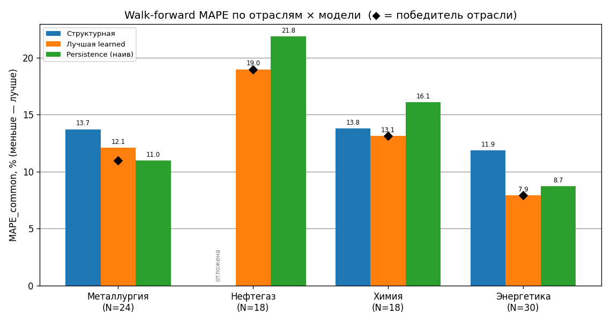
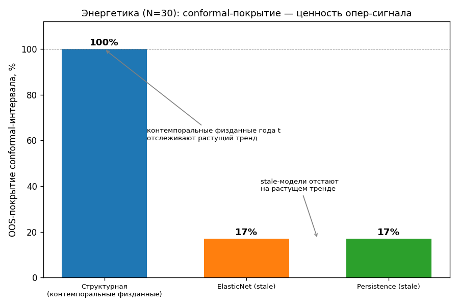

# DS-синтез — кросс-отраслевой разбор (4 отрасли OSL)

> Сводит воедино четыре DS-отчёта — [металлургия](DS_REPORT.md) · [нефтегаз](DS_REPORT_OILGAS.md) ·
> [химия](DS_REPORT_CHEMISTRY.md) · [энергетика](DS_REPORT_ENERGY.md). Каждый — реальная панель
> FY2021–2025, честная out-of-sample walk-forward + split-conformal, наивные бейзлайны, явные
> ограничения. Здесь — **один нарратив поверх четырёх**.

**Изоляция:** только публичные данные. Никаких клиентских/портфельных данных банка.

> [!note] Что этот документ НЕ делает
> Он **не вводит новых модельных результатов** — все MAPE/DM берутся напрямую из
> `_tools/output/osl_metrics/<отрасль>_metrics.json` (их пишет walk-forward), а conformal-числа
> транскрибированы из четырёх DS-отчётов (в JSON их нет). Графики и сводная таблица
> воспроизводятся одной командой: `cd _tools && python ds_synthesis.py`.

---

## 1. Главный вывод

**Победитель прогнозной гонки зависит от РЕЖИМА ДАННЫХ отрасли — это паттерн, а не закон.**
На четырёх отраслях (N=18–30) ни в одной learned-модель не бьёт разумный бейзлайн со
**статистической значимостью**: все тесты Diebold-Mariano дают `p>0.05` (нефтегаз — пограничные
`0.053`). То есть на панелях такого размера данные **не отличают** «умную» модель от наивной —
и честный вывод проекта в том, чтобы это показать, а не замаскировать тюнингом.

Ценность операционного сигнала (OSL) проявляется **не в точечном MAPE, а в conformal-интервалах**:
там, где есть контемпоральные физданные года *t* (энергетика), структурная модель покрывает
растущий тренд на **100%**, а stale-модели (persistence/learned на прошлогоднем уровне) — на **17%**
(покрытие на малом calib-наборе — over-covered, не «доказанные 90%»; разбор и оговорки — §5).

---

## 2. Обзор панелей

| Отрасль | N | Эмитенты | Структурная | Ключевой gap |
|---|---|---|---|---|
| Металлургия | 24 | 5 (Полюс, Норникель, Северсталь, ММК, НЛМК) | активна | смешение USD/RUB; нет цены палладия (~30% Норникеля) |
| Нефтегаз | 18 | 4 (Роснефть, ЛУКОЙЛ, Газпром, Новатэк) | **отложена** | НДПИ/демпфер по годам недоступны; ЛУКОЙЛ-2025 — деконсолидация |
| Химия | 18 | 4 (ФосАгро, Акрон, КуйбышевАзот, КОС) | активна | КуйбышевАзот без объёма; КОС объём только 2024–25 |
| Энергетика | 30 | 6 (РусГидро, Мосэнерго, ОГК-2, ТГК-1, Эл5, Юнипро) | активна | тепло/сбыт вне модели; РСБУ-прокси 2022–23 |

«Плохие клиенты», на которых модель не ложится, **исключены по ходу** (Уралхим/НКНХ в химии,
Интер РАО/Росатом в энергетике) — не подгонка выборки, а отказ от эмитентов без Q×P-структуры/отчётности.

---

## 3. Walk-forward — кросс-отраслево

Expanding-window, фолды 2022→2025. MAPE_common — на общем наборе *n*, где **все** модели дали
прогноз (валюто-инвариантна). Победитель отрасли отмечен ромбом.

| Отрасль | N (n) | Структурная | Лучшая learned | Persistence | Победитель | MAPE | DM p (vs база) |
|---|---|---|---|---|---|---|---|
| Металлургия | 24 (16) | 13.7% | 12.1% (hist_gbm) | 11.0% | **persistence** | 11.0% | 0.409 (н.з.) |
| Нефтегаз | 18 (14) | — отложена | 19.0% (hist_gbm) | 21.8% | **hist_gbm** | 19.0% | 0.053 (н.з.) |
| Химия | 18 (10) | 13.8% | 13.1% (elasticnet) | 16.1% | **elasticnet** | 13.1% | 0.920 (н.з.) |
| Энергетика | 30 (24) | 11.9% | 7.9% (elasticnet) | 8.7% | **elasticnet** | 7.9% | 0.144 (н.з.) |

*N — размер панели; n в скобках — общий набор для MAPE_common. DM p — победителя против **базы**
сравнения (структурная, где активна; в нефтегазе структурная отложена → база = persistence, поэтому
0.053 — это hist_gbm против persistence). Полная таблица (+conformal) —
[`figures/synthesis/summary_table.md`](figures/synthesis/summary_table.md), авто-сборка из JSON.*

**Все DM p>0.05** ⇒ ни один победитель не отделён от структурной базы статистически. Это не
слабость метода, а свойство данных: 4–6 эмитентов × 5 лет — слишком мало, чтобы различать модели.
Любое «X% лучше Y%» здесь — **направление, а не доказательство**.

---

## 4. Четыре режима данных

Почему в каждой отрасли «выстреливает» своя модель — содержательно:

| Режим данных | Отрасль | Победитель | Механизм |
|---|---|---|---|
| Малый, изолированный, коллинеарные цены, смесь валют | Металлургия | persistence | нечего различать; регуляризация **переобучается** на 24 точках |
| Волатильный commodity, FX-confound, gap-годы | Нефтегаз | learned (gbm) | волатильность **ломает** наивное «прошлый год = текущий»; цены/объёмы дают ~13% skill |
| Чистый Q×P, публичные цены, нет структурных дыр | Химия | структурная competitive | физическая формула **не хуже** elasticnet и интерпретируема |
| Большой, гладкий растущий тренд, регулируемая выручка | Энергетика | learned/persistence | тренд (РСВ/КОМ + индексация) ловится тривиально; тепло **вне** структурной |

Вывод: **не существует одной «лучшей» модели OSL**. Архитектура держит три семейства
(структурное / learned / наивное) и честную валидацию, которая выбирает победителя под режим, а не
постулирует его.

---

## 5. Conformal — где структурная реально выигрывает (суть OSL)

Точечный MAPE — не вся история. Split-conformal даёт **интервалы с гарантией покрытия**, и здесь
видна ценность операционного сигнала: контемпоральные физданные года *t* отслеживают тренд, тогда
как stale-модели (на прошлогоднем уровне) систематически промахиваются вверх на растущем рынке.

| Отрасль | Модель | OOS-покрытие | Ширина | Примечание |
|---|---|---|---|---|
| Металлургия | structural | 6/6 (100%) | ±24.7% | малый calib (n=5) → артефакт малого N |
| Нефтегаз | hist_gbm | 6/8 (75%) | ±28% | структурная отложена; persistence 7/8=88% |
| Химия | elasticnet | 6/8 (75%) | ±20% | структурный conformal **ненадёжен** (1/6=17%, объёмы разрежены) |
| Энергетика | structural | 12/12 (100%) | ±34% | **контемпоральные физданные покрывают тренд; stale 2/12=17%** |

> [!warning] Честность conformal
> calib-наборы малы (n=2–6) → покрытие **шумное**, не «out-of-sample 96%». Энергетика (N=30) —
> единственный достаточно чистый случай: там 100% vs 17% — реальная демонстрация. В химии
> структурный conformal, наоборот, **проваливается** (разреженные объёмы) — и это показано, а не скрыто.

---

## 6. Честные ограничения по отраслям

- **Металлургия** — смешение USD (Полюс) / RUB (сталевары); нет цены палладия (~30% выручки
  Норникеля); цена стали через прокси железной руды; сильная коллинеарность цен (cond раздут малой выборкой).
- **Нефтегаз** — ЛУКОЙЛ-2025 = деконсолидация (структурный разрыв, несравним с 2021–24); два
  gap-года (нет МСФО); структурная отложена (годовые НДПИ/демпфер недоступны) → база = persistence.
- **Химия** — КуйбышевАзот без раскрытия объёма; КОС объём только 2024–25 (k на n=2, почти точный
  in-sample фит — неинформативно); base-цены World Bank-2025 предварительны (low confidence).
- **Энергетика** — тепло/сбыт не моделируются (поглощаются `k`, неидеально для теплоёмких
  РусГидро/Мосэнерго/ТГК-1); РСБУ-прокси Мосэнерго/ОГК-2 за 2022–23; годовые РСВ/КОМ частью оценочны.

---

## 7. Вывод и следующий шаг

На малом N **единого «лучшего» прогнозиста нет** — и проект это честно фиксирует, а не прячет за
подобранной метрикой (см. урок энергетики: откат с раздутых 8.06% на честные 11.88% после удаления
интерсептов на тепло). Ценность слоя OSL — в трёх вещах: **(1)** опережение МСФО на 2–3 месяца
(физданные выходят раньше отчётности); **(2)** интерпретируемость структурной формулы Q×P;
**(3)** честные интервалы, где структурная покрывает тренд там, где stale-модели промахиваются.

**Чтобы пробить потолок малого N** (повторяющееся ограничение всех 4 корп-отраслей) — нужна либо
бóльшая история (накопление лет), либо смена парадигмы на панель с большим N: **ОИВ = регионы×годы
(150–425 строк)**, где DM-значимость станет достижимой. Параллельно — калибровка на исторических
РФ-шоках (COVID-2020, санкции-2022, цикл ставки) для проверки реакции слоёв L1→L3.
